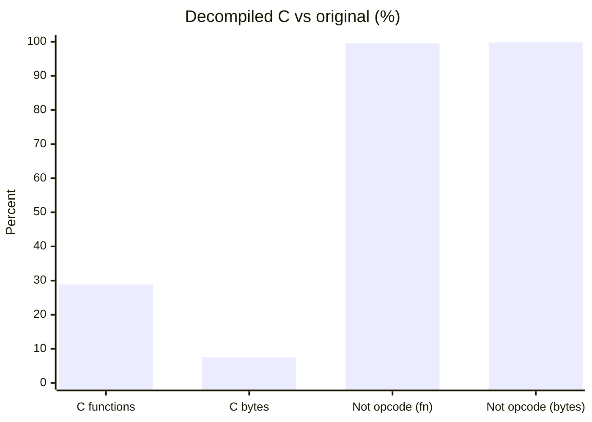
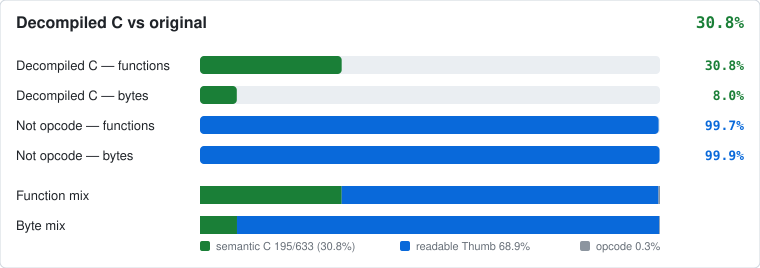

# Beyblade G Revolution

Decompilation scaffold for *Beyblade G Revolution* (GBA), structured after [pret/pokeemerald](https://github.com/pret/pokeemerald). Custom hacks follow the [ygodm8](https://github.com/JesterWizard/ygodm8) pattern: append ROM past the retail image, LynJump hooks, and `configs/runtime.c` toggles.

## Status

<!-- decomp-progress:start -->

Decompiled C is **28.9%** of functions (183/633) and **7.5%** of original function bytes (6,752/90,272).

| Metric | | Percent | Count |
| :--- | :--- | ---: | ---: |
| Decompiled C (functions) | `█████████░░░░░░░░░░░░░░░░░░░░░░░` | **28.9%** | 183/633 |
| Decompiled C (bytes) | `██░░░░░░░░░░░░░░░░░░░░░░░░░░░░░░` | **7.5%** | 6,752/90,272 |
| Not opcode (functions) | `████████████████████████████████` | **99.5%** | 630/633 |
| Not opcode (bytes) | `████████████████████████████████` | **99.8%** | 90,098/90,272 |
| Linked in ROM | `████████████████████████████████` | **100.0%** | 633/633 |





| Kind | Functions | Bytes |
| :--- | ---: | ---: |
| Semantic C | 183 (28.9%) | 6,752 (7.5%) |
| Readable Thumb | 447 (70.6%) | 83,346 (92.3%) |
| Opcode embed | 3 (0.5%) | 174 (0.2%) |

Battle: **9.4%** functions / **2.2%** bytes in semantic C (15/160; 0 opcode left).

Opcode `.byte` embeds are the retail machine code and do not count as decompiled C. Readable Thumb is matching asm. Unmatched ROM ranges stay `.incbin`'d from `baserom.gba` so `make compare` can stay green. Refresh with `python3 tools/decomp/progress.py --write` or `make progress`.

<!-- decomp-progress:end -->

## Quick start

See [INSTALL.md](INSTALL.md).

```bash
# after placing baserom.gba
make compare          # vanilla rebuild (default HACKS=0)
make HACKS=1 modern   # link append ROM (runtime + src_custom)
```

## Hands-off AI decompilation

See [AGENTS.md](AGENTS.md). One-time setup, then batch runs:

```bash
bash build_tools.sh              # agbcc, Luvdis, Mizuchi
export ANTHROPIC_API_KEY=...       # for Mizuchi Claude phase
tools/decomp/run_batch.sh 10     # decompile 10 easy functions
python3 tools/decomp/report_status.py
```

## Layout

pret/pokeemerald-style matching tree, plus a small ygodm8 hack overlay:

| Path | Role |
|------|------|
| `asm/` | Matching ARM/Thumb + baserom peels |
| `src/` | Matching C (`src/matched/` until Phase 5 packs by module) |
| `include/` | Headers (`gba/`, `ram_map.h`, types) |
| `data/` | Extracted data (`data/event_scripts/` reserved) |
| `docs/` | Decomp notes, RAM map, progress bar |
| `graphics/`, `sound/`, `constants/` | Extracted assets / asm constants (reserved) |
| `tools/` | pret tools + `tools/decomp/` matching pipeline |
| `libagbsyscall/` | BIOS syscall helpers |
| `ld_script.ld`, `sym_*.txt`, `rom.sha1` | Linker map, RAM symbols, compare checksum |
| `src_custom/`, `configs/` | ygodm8-style append hacks (not used by `make compare`) |

## Matching workflow

1. Disassemble / analyze `baserom.gba` (Ghidra, etc.).
2. Replace a range in `asm/rom.s` with a real object in `asm/` or `src/`.
3. Update `ld_script.ld` and the Makefile source lists.
4. `make compare` — keep the SHA1 green (vanilla peels only).

## Adding a hack (ygodm8-style)

1. Add a toggle in `configs/runtime.c` / `include/runtime.h`.
2. Implement `Name__Replacement` in `src_custom/*_hooks.c` (linked in append ROM).
3. Add a stub in `src_custom/LynJump.event` (`ORG` vanilla offset + `POIN` replacement).
4. `make` — linker places append code past 4MB; `apply_lynjump.py` patches the entry.

Target ROM: **USA/Europe**, SHA1 `a89f7b4eb77dc986022201db51a676451ba7c5e4`.
